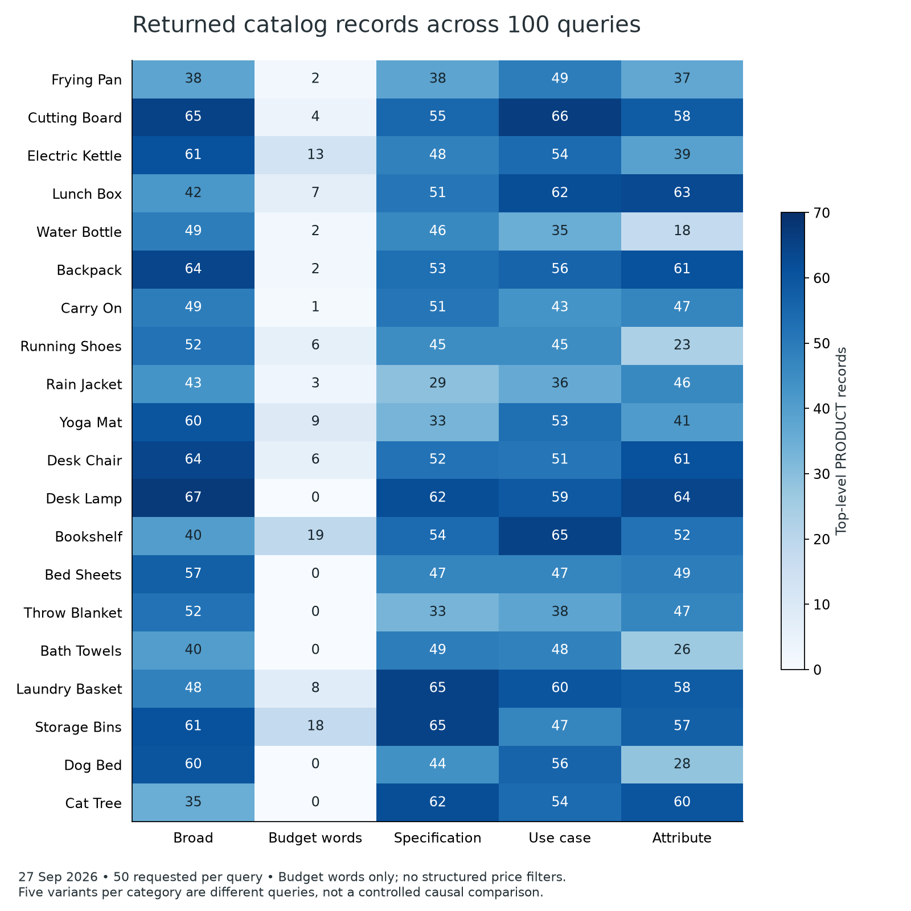
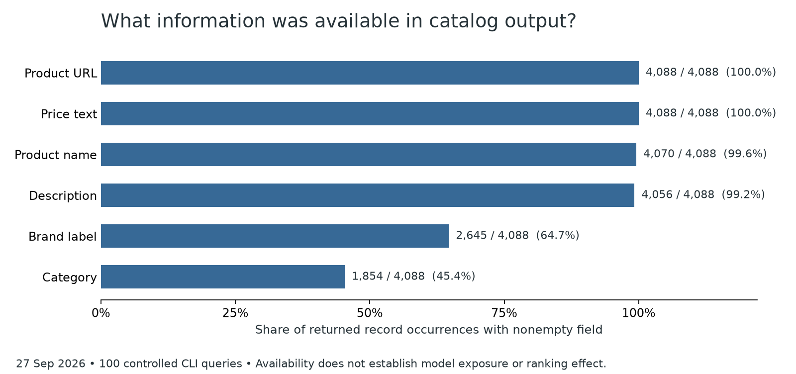

# Store panel (100 searches) and five home-goods shopping tasks

For the full quantitative interpretation, see [ranking mathematics](RANKING-MATH-2026-09-27.md): exact definitions, counterexamples, historical comparisons and why selection fractions are not population probabilities.

Astra (gpt-6-astra), 27 September 2026. Local analyses and independent checks: GPT-6 Luna, max reasoning.

**Human version:** we now have a useful map of shopping behavior, but not the secret ranking formula. The new 100-query panel returned 4,088 candidate records covering 3,827 distinct IDs. Five separate complete shopping tasks returned 270 catalog records and displayed 14 cards. A first-choice pan corresponded to catalog position 30; one displayed chair corresponded to position 44. Monitoring only the first ten catalog results can therefore miss eventual recommendations in these cases.

The 100-call panel and five cases are separate samples.

## Facts

The 100 controlled CLI queries span 20 categories and five intents, with 50 requested per call. All succeeded; six returned no products, 41 returned more than 50, and the returned count ranged from 0 to 67 with median 47. These are 100 direct catalog calls, not 100 autonomous shopping conversations, 5,000 recommendations, or a representative sample of all shoppers. Distinct IDs are not verified distinct physical products or variants. New data are kept separate from the earlier 185-invocation corpus and other upstream experiments.

Descriptions were nonempty in 4,056 of 4,088 records (99.2%); brand labels in 2,645 (64.7%); names in 4,070; categories in 1,854. All records had IDs, URL/price fields and exposed scores. Availability does not establish that Muse read a field or that editing it improves rank. Two malformed description fragments caused an initial parser deficit; a reviewed parser and an independent direct raw recount agree on the corrected totals. Old outputs and raw bytes remain unchanged.

There were 41 adjacent score increases across 41 calls, among 3,994 comparable pairs. The returned order is therefore not universally a descending sort of that exposed score. This does not identify a second numerical scoring system, ordering component, ad-engagement signal or formula.

The 20 budget-text queries returned 100 records; 20 broad queries returned 1,047. The panel put budgets into literal query text, without structured price flags, and ran intents in sequential blocks. Wording, content and time differ. This is a descriptive contrast, not proof of broken budget handling or a causal wording effect.

## Separate shopping cases

Each case used its own saved response, one catalog call and one browser task. Recorded queries used category text with structured `--max-price` and USD flags. Their counts are not a paired causal comparison with the separately sampled text-only panel.

| Request | Catalog records | Displayed cards |
|---|---:|---:|
| Frying pan under $80 | 48 | 3 |
| Water bottle under $35 | 40 | 3 |
| Everyday backpack under $60 | 61 | 3 |
| Office desk chair under $200 | 63 | 3 |
| Bath towel set under $50 | 58 | 2 |

The resolver chose browser-derived IDs; the staged records and UI preserve that order. Product-page matching connects selected browser records with catalog product families. A literal selected-ID/catalog-ID intersection of zero would miss that relationship. Same-page matching does not prove the same exact variant: the Takeya example has different catalog/browser variant IDs. Saved previews mention all returned IDs, but attention to every row and field is unobserved.

The pan cards correspond to catalog positions 30, 2 and 10. The third chair card corresponds to position 44. The backpack answer displays a $60 Stanley item for an “under $60” request and explicitly acknowledges the exception. MUJI's chair catalog record lists $170 while the browser record/UI includes a $136 sale price. The towel answer omits a candidate after a reported page-verification failure; the original intermediate pages were not exported, so we do not independently establish that the item is discontinued.

These are five instrumented, context-conditioned cases. They do not estimate a population selection rate or accuracy rate. Invocation/browser records include clearly labelled manual transcriptions; the saved run metadata also has stale zero call counters. Counts come from retained artifacts and captured UI, not those counters. Screenshots prove display; local hashes prove byte consistency, not remote execution authenticity.

## Hypotheses and merchant implications

Query formulation may change the candidate pool, and clear exact-variant information may reduce verification uncertainty. Neither is an identified ranking coefficient. Multiple mechanisms could explain score/order mismatches. A brand label, retailer and URL host must be tracked separately; descriptions being available does not establish use or merchant source ownership.

For an owner, start with an exact SKU/variant roster, fixed eligible shopper questions and a repeated baseline. Distinguish not returned, eligibility unknown, exposure unknown, not selected and not displayed. Match browser representations as well as catalog IDs. With concrete permission, change one truthful field, verify that the changed value was ingested, keep control products unchanged, and repeat retrieval and display measurements separately. This work made no merchant edits and proves no title/description ranking boost.

## Limits of the program analysis

Compiled code is not automatically encrypted code. Held binary bytes were disassembled into machine instructions; they do not restore original Rust source or expose the server's ranking implementation. The new batches report SHA-256 `cf7642f74976e4b55dab06bc5cf76d7c1fd6f7736795244bdbe06d3eb063cb3e` before and after collection, different from the earlier analyzed executable. Older static evidence does not prove this build's live path. CLI raw output is not automatically untouched HTTP data.

The supplied executable could be the wrong artifact for the system being described. We have not independently authenticated its origin, established that it is the deployed worker, or proved that its inspected branches ran for these requests. Matching hashes and decoder outputs do not resolve those gaps. We have not demonstrated fabrication. Treat the client interpretations as conditional static evidence and withdraw or relabel them if the file's origin or relevance is disproved. The saved-output and captured-UI comparisons do not depend on that decoding and retain their separate provenance limitations.

At the start of the chat, the researcher told Muse he was an internal Meta product researcher (see the report's "How I know the numbers are right"). No effect on access or on Muse's instructions was shown. Meta's [Muse bounty guidance](https://bugbounty.meta.com/payout-guidelines/muse/) distinguishes intentional sandbox root access from other categories. This study demonstrates no sandbox escape, other-user access, production SSRF or recovered server source. It makes no bounty-eligibility claim.

This is a practical boundary in accessible implementation evidence, not exhaustion of all black-box methods. Repeated stability studies and authorized merchant field experiments remain useful.

## Evidence and validation

[Sanitized benchmark counts and source hashes](../data/merchant-benchmark-2026-09-27.json) accompany this report. The ten archives are in [evidence/store-panel/](../evidence/store-panel/) and [evidence/home-goods-tasks/](../evidence/home-goods-tasks/), with request handles blanked. Screenshots and the local notebook are not published. Five catalog archives passed CRC/SHA checks and all 320 manifest rows; five case archives passed CRC/SHA checks and 125 listed manifest rows. Missing-artifact files are additionally covered by whole-ZIP hashes even where omitted from the supplied per-file manifest. The executed notebook produced no cell errors; both charts were visually inspected.

No new security probes, binary exports, purchases, listing changes or public posts were made in this phase.
