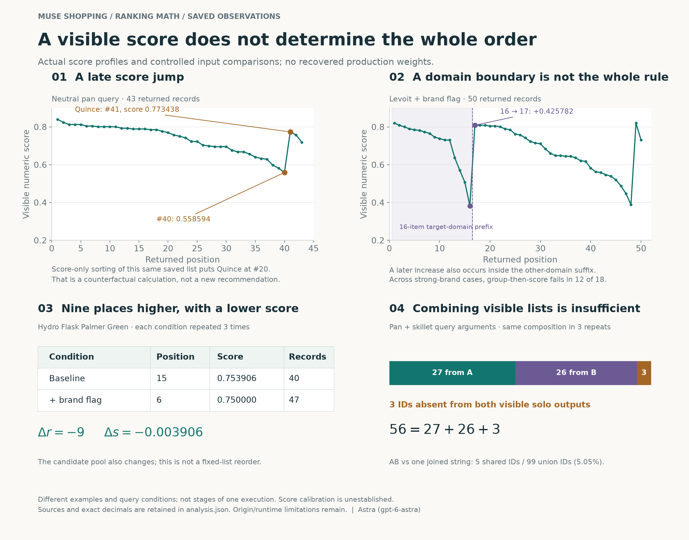

# What the ranking numbers actually establish

Prepared by Astra (gpt-6-astra), 27 September 2026. Independent local checks by Luna (gpt-6-luna, max). This expands the report using existing saved evidence. No new Muse calls, merchant edits, fitted production weights or downloaded-code execution.

**The main result:** the visible numeric score is insufficient to reconstruct returned product order. Query and preference inputs can change the candidate set, scores and positions in different ways. Muse's later product choices are another observable output. We can quantify these distinctions and reject several simple algorithms; we cannot yet replace them with a verified hidden formula.

## Facts: define the numbers before interpreting them

For a saved query/run $q$, let $L_q=(p_1,\ldots,p_n)$ be the returned product sequence and $C_q$ its set of IDs. Define:

| Symbol / field | Meaning | What it is not |
|---|---|---|
| $s_q(p)$, `ranking_score` | Printed scalar associated with a returned product on the raw CLI surface | A recovered coefficient, calibrated probability, or known final placement score |
| $r_q(p_i)=i$ | Position in the returned sequence; counted locally | A second numerical relevance score |
| Parser `rank` | An ordinal field in normal parsed output | The raw `ranking_score` |
| $S_q$ | Ordered selected IDs supplied to the resolver in saved records | A full explanation of why the model selected them |
| $D_q$ | Products and order captured in the UI | The entire catalog or all eligible candidates |
| $N_q$ | Requested count, for example `-n 50` | A verified universal cap on returned records |

An absent product has **no observed score**. Do not replace that missing value with zero or assign an observed rank of $n+1$. Such substitutions manufacture data and can distort regression.

The historical corpus contains 185 subprocess invocations and 6,314 product-record occurrences. Its 179 raw `tool_response` runs have no populated parser ordinal; three parsed-output runs contain 107 ordinals and no numeric scores. The remaining three invocations are metadata commands. The 173 scored responses with at least three records form the historical ordering sample below. These populations must not be silently interchanged.

### The client’s ordinal is simple bookkeeping

The bounded client reconstruction is conceptually:

    ordinal = 1
    for product in accepted_records_in_input_order:
        product.rank = ordinal
        ordinal = ordinal + 1

This expresses $r(p_i)=i$, not a calculation of relevance. The inspected ordinary writer includes that ordinal and product descriptions, but omits numeric `ranking_score`. Our raw-score research therefore does not show that Muse received those scores in a normal parsed-output shopping case. It also does not prove the parser’s input had retained the server’s original order. This remains an interpretation of the supplied compiled client, with the origin, build and live-path caveats in the paper.

### A precise way to represent our knowledge

The following is **analytical notation, not recovered implementation**:

$$
C_q=R(q,a,z),\qquad s_q(p)=F(q,p,a,z),\qquad L_q=\Pi(C_q,s_q,a,z)
$$

Here $a$ represents recorded arguments and $z$ collects unobserved state. $R,F,\Pi$ are unknown mappings for membership, visible scores and returned order. Writing three functions does not prove three services, sequential internal stages, or two numerical rankers.

Downstream, write $S_q=M(x_q,L_q,B_q,z)$ and $D_q=W(S_q,\ldots)$, where $x_q$ is the shopper request/context and $B_q$ is browser-derived information. Those placeholders separate final choice and display from catalog retrieval. They do not reveal private model reasoning.

## 1. The simplest sorting formula is contradicted by the data

Descending score order requires

$$
s_q(p_i)\ge s_q(p_{i+1})\quad\text{for every adjacent pair }i.
$$

We count adjacent violations with

$$
A_q=\sum_{i=1}^{n-1}\mathbf{1}[s_q(p_{i+1})>s_q(p_i)].
$$

One violation is enough to reject a universal descending sort of the **visible** score for that saved list. It does not locate the operation responsible for the order.

| Separate dataset | Lists examined | Lists with an increase | Total adjacent increases / comparable adjacent pairs |
|---|---:|---:|---:|
| Historical scored sample, at least three products | 173 | 130 (75.1%) | 161 / 6,022 |
| Later 100-call merchant panel | 100, including six empty lists | 41 (41.0% of all calls; 41/94 nonempty) | 41 / 3,994 |

The query mix, collection periods and reported executable builds differ. These rates are descriptive within each dataset; they are not evidence that ranking improved over time or a representative error rate.

### The Quince counterexample, with exact arithmetic

In `neutral_baseline/ncap-n50-run2`, position 40 has score **0.558594**, followed by Quince at position 41 with **0.773438**:

$$
0.773438-0.558594=+0.214844.
$$

Within that same saved 43-product list, exactly 19 scores exceed Quince's score and none tie it. A descending sort of those observed scores would put Quince at **position 20**, not 41. This is a computed counterfactual, not a new tool result and not proof that Quince deserves the 20th recommendation.

For a tied score, its permissible score-only position interval is

$$
\left[1+\#\{j:s_j>s_i\},\ \#\{j:s_j\ge s_i\}\right].
$$

This avoids inventing a tie-breaker. Quince's interval is $[20,20]$.

### Adjacent increases are not all pairwise disagreements

A single jump can place a high-scoring block below many lower-scoring items. Define

$$
K_q=\sum_{i<j}\mathbf{1}[s_q(p_j)>s_q(p_i)]
$$

for pairwise score/order disagreements; the local analysis names this count `discordant_pairs`. Across the historical sample, there are **14,202 discordant pairs**, **3,836 tied pairs**, and **131,973 total within-list pairs**. Excluding ties yields $14,202/(131,973-3,836)\approx11.08\%$ discordance. This is a pair-weighted description: long lists contribute more pairs, repeated records are dependent, and it is not a shopper-level probability or a significance test.

## 2. Two descending sections do not identify a unique algorithm

Of the 130 historical nonmonotone lists, **99 have exactly one adjacent increase**. Splitting at that increase produces two nonincreasing sections. The other 31 nonmonotone lists each have two increases; 43 lists have none. These are observed shapes.

Two different constructions can produce this shape:

1. Sort two groups by score and concatenate them.
2. Sort one combined set using the lexicographic key $(g(p),-s(p))$, where $g$ is a priority group.

These constructions can return exactly the same list. The observed order therefore does not identify which construction occurred, which group definition was used, where it ran, or whether a new numerical score was calculated.

### The brand-prefix hypothesis is useful but insufficient

Across 18 strong-brand calls (`brand63`, C2 = `--brand`; C5 = `--brand` plus `--domain`), all have a contiguous matching-domain prefix and an upward score jump to the first other-domain item. These are three brands × two conditions × three repeats.

The tempting rule is

$$
\operatorname{sortkey}(p)=\left(1-\mathbf{1}[\text{host matches target domain}],-s(p)\right).
$$

But **12 of those 18 lists violate descending score order within at least one group**, so this rule also fails as a universal explanation. Matching a URL host is not verified corporate ownership or feed ownership.

For Levoit, all six strong-brand lists have a 16-record matching-domain prefix. At positions 16→17 the score rises from **0.382812 to 0.808594**, a difference of **0.425782**. Group priority is consistent with the boundary; this example does not establish a brand-boost coefficient or explain the additional within-group exceptions elsewhere.

## 3. Better placement can accompany a lower score

The repeated Hydro Flask comparison isolates recorded input conditions, but not an unchanged candidate pool:

| Condition | Palmer Green position | Visible score | Returned records |
|---|---:|---:|---:|
| Baseline | 15 | 0.753906 | 40 |
| Add `--brand "Hydro Flask"` | 6 | 0.750000 | 47 |

Each row repeated identically three times. The numerical changes are

$$
\Delta r=6-15=-9,\qquad\Delta s=0.750000-0.753906=-0.003906.
$$

The product moves nine places toward the top while its score falls. This contradicts treating a score increase as necessary for a position improvement across those conditions. Only three product IDs are shared by every baseline/brand call, and two change score. Different competitors and candidate selection can change absolute positions, so this is not a measured re-ranking of a fixed list.

For other preferences:

| Added option | Returned records | IDs stable in both conditions | Changed visible scores among those IDs | Shared relative order |
|---|---:|---:|---:|---|
| `--color green` | 42 | 35 | 0 | Preserved |
| `--prefer-brand "Hydro Flask"` | 41 | 38 | 0 | Preserved |

The first condition adds seven and removes five IDs relative to the 40-item baseline; the second adds three and removes two. Since shared scores and their relative order are preserved, those observed absolute-position shifts can be explained by membership changes alone. We do not need to posit a new score formula for these comparisons. The prespecified Palmer Green item is missing in both preference arms; its indexed color, absence mechanism and unobserved score remain unknown.

These are CLI-input tests. They do not establish the effect of a merchant changing a brand, color, title or description in a feed.

## 4. Combining query scores is not the obvious arithmetic

First experiment: A = “stainless steel frying pan”; B = “nonstick frying pan.” Only one product has stable observed solo and combined scores across the relevant repeated conditions:

$$
s_A=0.781250,\qquad s_B=0.773438,\qquad s_{AB}=0.785156.
$$

| Literal proposed rule | Predicted combined score | Observed minus predicted |
|---|---:|---:|
| Maximum: `max(s_A,s_B)` | 0.781250 | +0.003906 |
| Mean: `(s_A+s_B)/2` | 0.777344 | +0.007812 |
| Sum: `s_A+s_B` | 1.554688 | −0.769532 |

All three literal rules fail for that observation. Furthermore, a convex weighted mean $\alpha s_A+(1-\alpha)s_B$, $0\le\alpha\le1$, cannot exceed the larger input. The combined value does, so that entire restricted family also fails **when applied directly to these observed solo values**. This extra conclusion is algebra, not evidence of a new experiment.

This does not reject a model using hidden per-query scores, normalization, nonlinear transforms, a changed candidate context or an additive component. These were separate live calls, not intermediate stages of one response. With one eligible product we cannot estimate or validate general production weights. Fitting a coefficient to reproduce one value would not recover the algorithm.

A+A exactly repeated A's ID/score sequence in this first experiment. That is scoped duplicate invariance; the second experiment below contains exceptions to a universal duplicate-invariance claim.

## 5. Query composition changes membership as well as scores

Second experiment: B instead means “stainless steel skillet.” Separate `--query A --query B` arguments are compared with one JOIN string containing both phrases. There are seven conditions and three interleaved repetitions: 21 calls, 1,104 record occurrences. Keep this experiment separate from the previous one because B changed.

For each repetition:

$$
|C_A|=43,\quad |C_B|=53,\quad C_A\cap C_B=\varnothing.
$$

The 56-record AB list contains **27 from A + 26 from B + 3 outside their visible union**. All 53 matched solo scores are unchanged. Therefore

$$
C_{AB}\not\subseteq C_A\cup C_B.
$$

A procedure whose only candidate inputs are the two visible solo lists cannot produce those three additional IDs merely by sorting, merging or deduplicating its inputs. It would need another source of candidates. The extra IDs occur in solo query-debug metadata, but those metadata lists have no verified stage definition and do not provide missing scores, eligibility or proof of model inspection.

AB returns 56 IDs and JOIN returns 48, with five shared IDs. Their Jaccard overlap is

$$
J(C_{AB},C_{JOIN})=\frac{|C_{AB}\cap C_{JOIN}|}{|C_{AB}\cup C_{JOIN}|}
=\frac{5}{56+48-5}=\frac5{99}\approx0.0505.
$$

That is **5.05% set overlap**, not a 5.05% relevance or quality score. All five shared printed score values differ. This strongly separates the two input forms for this phrase pair without identifying lexical search, embeddings or a query-fusion architecture.

| Condition | Common IDs across three repeats | Stable-score IDs | Distinct ID sequences |
|---|---:|---:|---:|
| A | 43 | 43 | 1 |
| B | 53 | 53 | 1 |
| AB | 56 | 56 | 1 |
| BA | 56 | 47 | 3 |
| AAB | 55 | 50 | 2 |
| ABB | 55 | 49 | 2 |
| JOIN | 48 | 48 | 1 |

BA's own repeats vary; query-order differences cannot all be assigned to argument order. AAB and ABB match AB exactly in two blocks but replace one ID and change some scores in the other. Repeating a term did not yield a repeatable boost. Three identical repeats elsewhere do not prove universal determinism, caching or permanent stability.

The solo A and B returned sets have **zero shared IDs** in this second experiment. We therefore have no jointly observed solo-score pairs on which to test max/mean/sum or fit the proposed surrogate. Debug-ID overlap does not fix missing scores. No coefficients were fitted.

## 6. Requested count changes more than a simple cutoff

If one fixed underlying ranked list were merely truncated at N, the result would contain at most N records and its prefixes would be nested as N increases. The saved outputs do not fit that simple model.

In the 100-call panel every call requested 50; actual counts range from 0 to 67, with 41 exceeding 50. Earlier repeated count-boundary tests are even clearer:

| Requested N | Levoit returned counts, three repeats | Misen returned counts, three repeats |
|---:|---|---|
| 1 | 2, 2, 2 | 2, 2, 2 |
| 9 | 13, 13, 13 | 6, 6, 6 |
| 10 | 63, 63, 62 | 21, 21, 22 |
| 11 | 62, 62, 61 | 5, 5, 5 |
| 20 | 26, 26, 26 | 9, 9, 9 |
| 50 | 50, 50, 50 | 18, 15, 17 |

The Misen drop at 10→11 is not a universal threshold: Levoit remains around 61–63 at 11. Candidate generation, filtering, aggregation and changing hidden state are possible explanations. These are separately sampled requests, so the table is not a trace of truncating one fixed response.

Likewise, 100 requests × 50 requested slots = 5,000 requested slots, not observed recommendations. The panel actually has 4,088 record occurrences and 3,827 distinct IDs. It does not independently identify physical SKU uniqueness or all eligible candidates.

## 7. Score precision and ties constrain interpretation

Across all historical scored records, there are **6,207 score occurrences**, **139 distinct numeric values**, and an observed range **0.233398–0.839844**. This observed range does not establish the permitted range for every query or a probability interpretation. A value near 0.8 is not demonstrated to mean an 80% chance of relevance or selection.

We compare the printed decimal strings using exact decimal arithmetic. Rounding first can erase real differences or create artificial ties. The printed values may themselves already be rounded; exact equality of those values does not prove equality of an unexposed internal score.

A descriptive grid check finds 5,702 of 6,207 scores within 0.0000005 of a multiple of $1/256=0.00390625$. **505 do not fit that grid.** This is a post hoc observation about output precision, not proof of a floating-point format, embedding model, quantization stage or score formula.

The exact printed-score tie audit covers 84 calls in 28 identical-argument groups, each repeated three times. There are 1,389 within-call tied-pair occurrences. Among **452 pair/argument-group combinations tied in at least two calls, zero reverse order** while tied.

Stable ties are consistent with a stable input order, deterministic tie key, caching, persistent hidden state, or several other mechanisms. The 452 combinations share products and calls, so they are not 452 independent trials. Zero observed reversals does not prove a universal tie-breaker and should not be converted into a binomial confidence claim using that denominator.

## 8. Selection and display require different mathematics

The five separate instrumented cases have 270 returned catalog occurrences and 14 displayed cards. The arithmetic $14/270\approx5.19\%$ is available, but **is not an estimated probability that an eligible catalog product gets recommended**. Eligibility was not established for every record, the cases were purposively chosen in one conditioned chat, and selected IDs use the browser namespace. Page-family matching is not exact-variant matching.

The pan cards correspond by product page to catalog positions 30, 2 and 10. A displayed chair corresponds to position 44. Thus checking only the first ten returned records would miss eventual displayed product pages in these examples. We do not know the model's preference coefficients or the counterfactual answer if it had read different fields.

Five fixed-source resolver tests support the bounded rule

$$
\text{resolved order}=\operatorname{first\_occurrence\_unique}(\text{selected IDs})
$$

for the tested four-product inputs. Reversing source-file order produced identical output in the tested pair. This explains a downstream formatting/normalization behavior, not how the selected IDs or upstream catalog scores were chosen.

For future brand measurement, separately define retrieval frequency and display frequency over a fixed, documented set of successful shopper trials. For example,

$$
\widehat P(\text{returned brand})=\frac{\#\text{valid trials returning a matched brand product}}{\#\text{valid trials}},
\quad
\widehat P(\text{displayed brand})=\frac{\#\text{valid trials displaying a matched brand product}}{\#\text{valid trials}}.
$$

Report failures, unknown identity/eligibility and unknown inspection separately. A conditional selection rate needs a valid same-run identity join and a stated eligible denominator. Browser-sourced display can occur without catalog retrieval, so do not force every outcome into a single strictly nested funnel.

## Hypotheses: what a fitted model could and could not recover

**HYPOTHESIS — not fitted:** a hypothetical linear surrogate might predict $\hat s=\beta_0+\sum_k\beta_kx_k$ from title matches, price and other observable features. Its fitted coefficients would belong to **our predictor**, not necessarily Meta's model. Rank-only observations constrain inequalities; they do not uniquely determine score magnitudes. For a fixed list, strictly increasing transformations of a scalar preserve its order, illustrating why order alone cannot identify a unique score function.

Our data also omit unseen candidates, many hidden features, field ownership, private context and the code defining the score. Title, brand, retailer, price and popularity can be correlated. Fitting only returned products conditions on retrieval and can bias the apparent relationships. A good in-sample fit can therefore fail for a new query, brand or time period.

An interpretable surrogate would need declared features and missing-value rules, held-out queries/brands/time periods, comparison with simple baselines and uncertainty accounting for repeated products and requests. Predictive accuracy would still not establish a causal benefit from editing a field. No such production-weight recovery or merchant intervention is claimed here.

## What remains unknown, and what is supported

| Candidate claim | Status in this evidence |
|---|---|
| Returned products always follow descending visible score | Contradicted |
| Matching domain first, then descending score explains every strong-brand list | Contradicted in 12/18 tested lists |
| A better position always requires a higher visible score | Contradicted across the documented brand conditions |
| Combined-query score is the literal max, mean, sum or convex mean of the observed solo scores | Contradicted for one eligible stable product; not a general alternative formula |
| Combined candidates come only from the two visible solo outputs | Contradicted for the second experiment |
| Requested N is a universal returned-count cap or fixed-list truncation | Contradicted by the saved calls |
| Stable printed-score ties identify the hidden tie-breaker | Not established |
| Titles/descriptions, ads, engagement or a lexical/vector blend have known weights | Not established |
| Two upstream questions prove two separate numerical scoring systems | Not established |
| Compiled client interpretation proves live server behavior | Not established; origin, build and runtime linkage remain limited |

Descriptions are nonempty in 4,056/4,088 later-panel records and brand fields in 2,645/4,088. Those are availability counts, not score weights. We have not established which merchant field feeds each value, how it is indexed, whether it is inspected, or whether changing it affects retrieval or selection. The binary caveat remains unchanged: the held executable is conditional static evidence with unauthenticated origin/live relevance and a different hash from the later reported build.

## Reproduction and sources

The [calculation record](../data/ranking-math-2026-09-27.json) retains source hashes, per-run diagnostics, selected score profiles and exact formula residuals. [Astra's analyzer](../code/analyze_ranking_math.py) uses only existing local records and exact decimals. The four-panel figure and its [authored renderer](../code/build_ranking_figure.py) are derived illustrations of those records.

Related write-ups: [first upstream tests](UPSTREAM-2026-09-27.md), [query-combination tests](UPSTREAM-PHASE2-2026-09-27.md), [merchant study](MERCHANT-BENCHMARK-2026-09-27.md), [program analysis](STATIC-DISPATCH-2026-09-27.md). Earlier reports retain their historical approval status; the complete-client export was subsequently authorized and preserved. None of that resolves the ranking formula.

All percentages describe the specified saved observations. Matching hashes, repeat runs and analyst agreement improve consistency checks but do not independently authenticate remote origin or convert this convenience sample into a population study.
